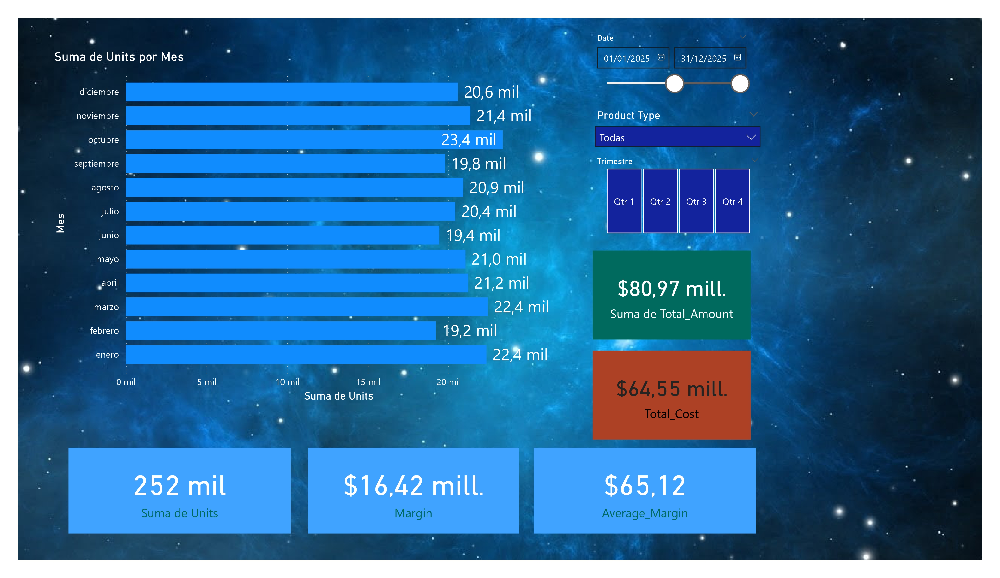
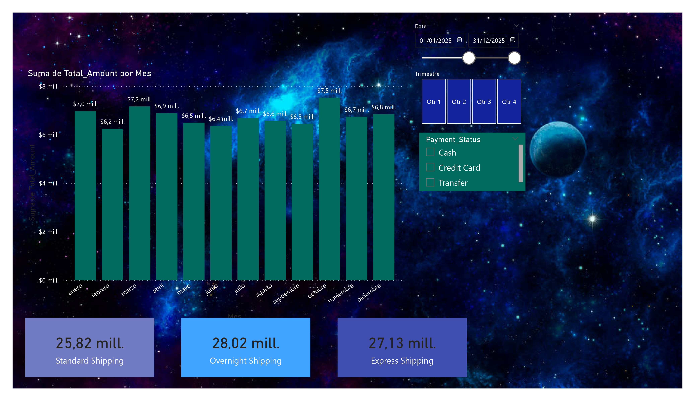

This is a shortest version of my style of work with Python and HTML on VS Code. I created a database with 18 columns then 6 charts of different approach. I'm just sharing my work style and focus target on this two tools.

